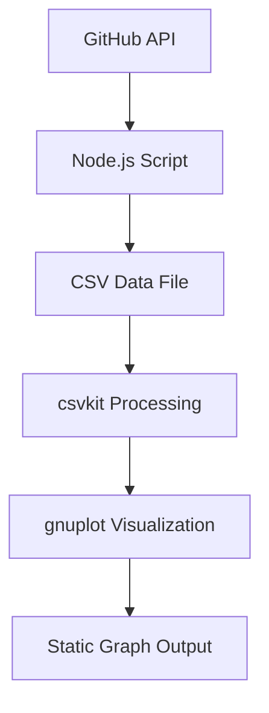
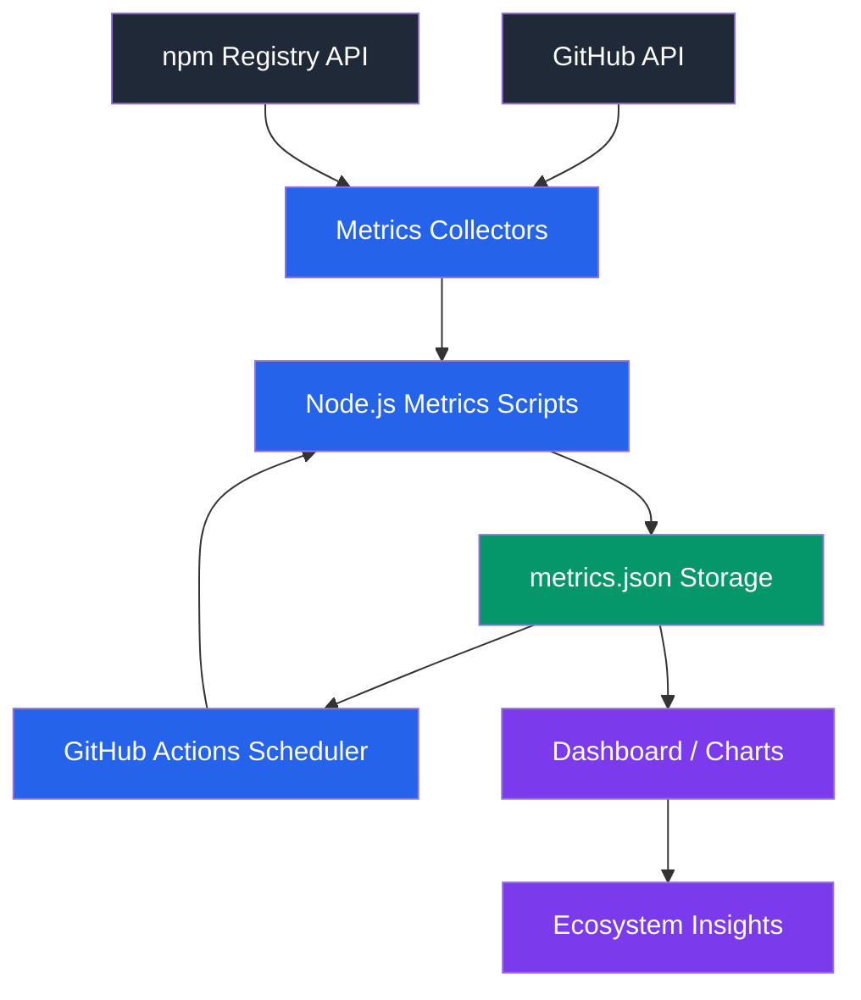

# ✨ Code Review & Assessment


## 🧠 Code Review
### ✔ What does it do well?

The proof-of-concept demonstrates a solid starting point for ecosystem data collection. It successfully uses the GitHub REST API to retrieve repositories based on a specific topic and extracts useful historical signals such as repository creation date, first commit date, and first release date.

The use of pagination via the GitHub API iterator is efficient and allows scaling to a large number of repositories. Additionally, the script handles multiple data points per repository and stores them in a structured CSV format, which is useful for initial analysis.

---

### ⚠️ What are its limitations?
While the script is useful as an initial data collector, it has several limitations:

Limited Scope of Data
It focuses only on repository creation and release history, without capturing broader ecosystem signals such as activity, popularity, or maintenance patterns.
REST-based Approach
The use of multiple REST requests per repository leads to inefficiencies and increased API overhead compared to a GraphQL-based approach.
Lack of Extensibility
The current implementation is tightly coupled to a fixed set of metrics, making it difficult to extend or introduce new types of analysis.
No Structured Processing Layer
Data is collected and stored directly without a clear separation between collection, processing, and analytics.
No Historical Snapshot System
Although it generates CSV files, it does not implement a structured snapshot mechanism for tracking ecosystem evolution over time.
Limited Automation
The workflow requires manual execution and external tools (e.g., csvkit, gnuplot), making it less suitable for continuous observability.

---

### 🧪 Did you try running it? What happened
Yes, I tested the script with a limited number of repositories. It successfully fetched repository data and generated a CSV file as expected.

However, execution was relatively slow due to multiple sequential API calls per repository. Additionally, rate limits (especially when integrating external APIs like the Internet Archive) can significantly impact scalability. The reliance on manual post-processing steps also made the workflow less streamlined


---

### 💡 Additional Notes
The proof-of-concept is valuable as an exploratory tool and demonstrates how historical repository data can be collected. However, it operates more as a standalone script rather than a scalable observability system

---

## 🚀 Recommendation

### Should we build on this code or start fresh?

Start fresh, while preserving key ideas from the approach

While the current implementation provides useful insights into repository history, it is not structured in a way that supports extensibility, scalability, or continuous observability. Building a new system allows designing a modular data pipeline with clear separation of concerns, better performance (e.g., using GraphQL), and support for evolving metrics and analytics


---

### What would you keep from the approach

The idea of analyzing historical signals (e.g., creation date, first release)
The concept of ecosystem-level data collection based on topics
The focus on understanding ecosystem evolution over time

---

### What would you change first

Replace REST-based data collection with GraphQL for efficiency
Introduce a modular pipeline architecture (collection → processing → analytics)
Implement a snapshot-based storage system for historical tracking
Design an extensible metrics framework instead of fixed data extraction
Automate the workflow using GitHub Actions

---


# Code Review of Initial Data Prototype

## Overview

The prototype in `projects/initial-data` aims to collect ecosystem data related to JSON Schema by analyzing GitHub repositories that use the `json-schema` topic.

The script gathers metadata such as repository creation date, first commit date, repository topics, and first release date.
This data is written into a CSV file and later processed to generate a graph showing ecosystem growth over time.

The approach provides a useful starting point for understanding how the JSON Schema ecosystem has evolved.

---

# What the Code Does Well

### 1. Clear goal and focused scope

The prototype has a clear purpose: identifying repositories related to JSON Schema and analyzing their historical activity.
This provides useful insight into ecosystem growth.

---

### 2. Uses the GitHub API effectively

The project uses the GitHub REST API through the Octokit library to retrieve repository information such as:

* repository creation date
* first commit date
* repository topics
* first release date

Using the official API ensures the data is reliable and consistent.

---

### 3. Handles pagination correctly

GitHub search results are paginated.
The code uses Octokit’s pagination iterator to retrieve repositories across multiple pages, which allows the script to process the entire ecosystem rather than only the first page of results.

---

### 4. Structured data collection

The script organizes the extracted data into rows and writes them to a CSV file.
This makes it possible to analyze the dataset later using external tools.

---

### 5. Error handling for API requests

The code includes try/catch blocks around some API calls, which helps prevent the script from crashing if a specific repository request fails.

---

# Limitations and Issues

### 1. High number of API requests

For each repository, multiple API requests are made:

* fetch repository details
* fetch repository topics
* fetch commits
* fetch releases

This significantly increases the number of API calls required.
For large ecosystems with thousands of repositories, this approach may easily reach GitHub API rate limits.

---

### 2. Inefficient method for retrieving the first commit

The script determines the first commit by requesting the last page of commits through pagination.
For repositories with long commit histories, this can be expensive and slow.

A more efficient approach might involve using alternative GitHub endpoints or metadata if available.

---

### 3. Complex setup requirements

Running the project requires several external tools:

* Node.js
* pnpm
* Python
* csvkit
* gnuplot

In addition, a personal GitHub API token must be manually created and configured.
This makes the setup process more complex for new contributors.

---

### 4. Lack of automation

The data collection process must be executed manually by running the script and processing CSV files through several command-line tools.

This prevents continuous tracking of ecosystem metrics over time.

---

### 5. CSV format limits flexibility

The project outputs data in CSV format. While this is suitable for spreadsheets, it is less flexible for long-term data collection or automated visualization.

Structured formats such as JSON may be more suitable for storing time-series ecosystem metrics.

---

### 6. Visualization pipeline is manual

After generating the CSV file, several additional commands are required to process the data and generate a graph using gnuplot.

This multi-step process increases complexity and makes the workflow harder to reproduce.

---

# Running the code
I followed the steps mentioned in 
```
https://github.com/json-schema-org/ecosystem/blob/main/projects/initial-data/README.md
```
I discovered that i need to create a folder with name **data** that each time i run the code, a .csv file created into it with name has its creation date to make sure we are not overriding on the current data.

# Recommendation

While the current prototype demonstrates useful ideas for collecting ecosystem data, I recommend starting fresh rather than extending the existing implementation.

The main reason is that the current project is designed as a one-time data analysis pipeline, whereas the goal of this project is to build a continuous observability system for the JSON Schema ecosystem. These two goals require very different architectures.

Current Architecture

The current implementation follows a pipeline designed primarily for manual analysis:

## Current Prototype Architecture



This architecture works well for generating a dataset once and producing a static visualization. However, it introduces several limitations when trying to evolve the system into a long-term observability platform as mentioned above.

Instead, a simpler and more extensible architecture can be implemented by starting fresh with a system designed specifically for ecosystem observability.

## Architecture



In this architecture:

Metrics collectors periodically gather ecosystem data from APIs.

The collected metrics are stored in a time-series dataset, allowing historical analysis.

Automation (e.g., scheduled workflows) ensures that data is updated regularly.

A dashboard provides clear visualizations of ecosystem trends over time.

Why Starting Fresh is Preferable

Starting fresh allows the system to be designed with observability as the primary goal. This enables:

automated and continuous metric collection

simpler and more maintainable data pipelines

structured time-series storage for ecosystem metrics

easier addition of new metrics in the future

integration with interactive dashboards

While the prototype provides valuable insights into collecting repository data from GitHub, rebuilding the system with a new architecture will result in a more maintainable, extensible, and automation-friendly observability platform for the JSON Schema ecosystem.

---

# What I Would Keep from the Current Approach

Although a fresh architecture is recommended, the current prototype still contains several useful components that can inform the new implementation.

First, the existing integration with the GitHub API using Octokit provides a solid reference for authentication, pagination, and repository search queries. This logic can be reused when implementing new metrics collectors.

Second, the repository processing logic demonstrates a practical approach for collecting multiple metrics from a repository and aggregating them into a single data structure.

Third, the prototype already identifies several useful GitHub API endpoints (such as repository metadata, commits, releases, and topics) that can be leveraged when designing ecosystem metrics.

Finally, the current implementation highlights important edge cases, such as repositories without releases or commits, which should be handled gracefully in the redesigned system.

These elements provide valuable insights and can serve as a reference when building the new observability pipeline.


---
